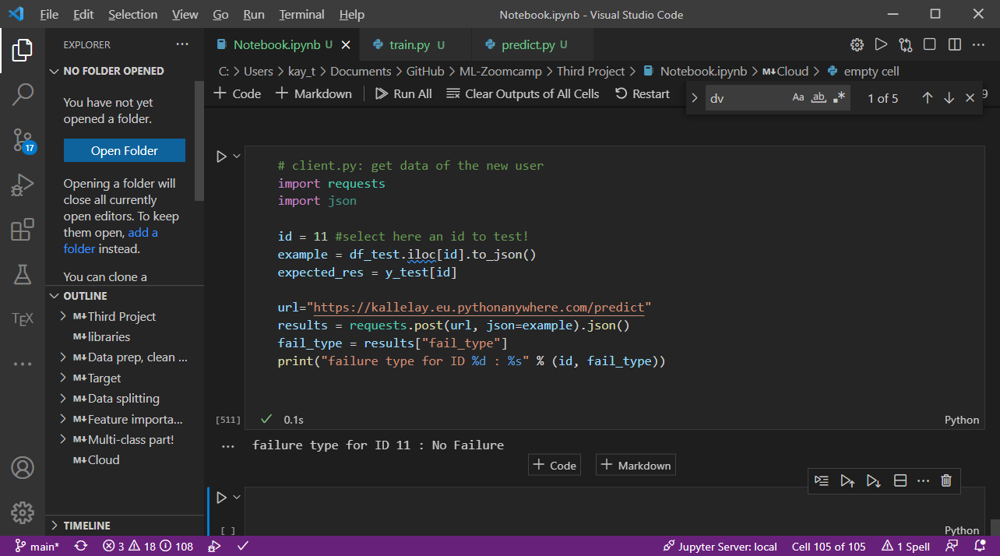

 # Documentation of Third project: Prediction of Failure/Failure Type in machine
by *Ahmed Yahia Kallel* for ML Zoomcamp.


## Part 1: On the database, features analysis and model selection

 ### Introduction
Electro/mechanical machines are subtle to failures. It's therefore interesting to detect and -if possible- predict their failure prior to happening.
In many cases, the checking comes manually based on several data (wear tool/temperatures/speed/torque), where a human assess the error by themselves.

In this project, we detect and find the fault within the machine, without human interaction.
The current code is capable of an accuracy of 94%.


 ### Database Description
This database [predictive_maintenance.csv](predictive_maintenance.csv) is originally downloaded from [https://www.kaggle.com/shivamb/machine-predictive-maintenance-classification](https://www.kaggle.com/shivamb/machine-predictive-maintenance-classification), which is then several 'no failure' IDs were removed to avoid data imbalance.


The data contains Unique ID and Product ID, both are unique index, in addition to machine type "L", "H" and M.
Further numerical features are:
- Air temperature (in Kelvin)
- Process temperature (in Kelvin)
- Rotational speed (in RPM)
- Torque (in Nm)
- Tool wear (in min)

This database has two possible outputs:
- Target: Failed or not
- Failure Type (Heat, Overstrain, Power, Tool Wear, Random) or No failure

Because, it is more interesting to find the fault type, "target" has been scrapped.


 ### Database Analysis
First analysis shows that the database contains 749 items
Full details and details feature analysis can be found in  [Notebook.ipynb](Notebook.ipynb) 

In this, I have tested RobustScaler and no scaler at all, the ones that have better results are kept

 ### Data preparation and model selection and tuning

 #### Implementation Details
 The database is split into 60% for training, 20% for validation, and 20% for testing using random_state=1.

 In this project, I have tried different classifiers:
* Decision Tree
* Decision Forest
* Extra Trees
* KNN
* Bayes
* Linear Classifer (Ridge)
* Neural Networks
* Linear SVC
* Voting Classifier
* Stacking Classifier

For each classifier, I have made parameters tuning to find the best of each. The accuracy is used as a metric


  <br/>
  
#### Results
|                           | Stacking | Stacking without NN | Voting | Linear SVC | NN   | Ridge | Bayes | KNN   | ExtraTree | DecisionTree | Random Forest |
|---------------------------|----------|---------------------|--------|------------|------|-------|-------|-------|-----------|--------------|---------------|
| Classification   Accuracy | 87.21    | 98.88               |100    | 100        | 99.7 | 83.51 | 89.08 | 88.41 | 100       | 100          | 100           |
| Validation   Accuracy     | 94       | 93.33               |90.66  | 89.33      | 80   | 82.66 | 86    | 83.33 | 87.33     | 92           | 92            |


```Stacking Classifier``` was selected as a final and best classifier


The final output of these classifiers are saved as pickle file as [model.bin](model.bin) and [dv.bin](dv.bin). You can also use

 Please use [predictTesterLocal/predict_tester.py](predictTesterLocal/predict_tester.py) to test predict.py by yourself


  <br/>

## Part 2: Documentation for further use/analysis
Please check Part 3 for dependency and environment management before using the files.

### Playground: [Notebook.ipynb](Notebook.ipynb): Analysis, Feature importance, Classification, small test


### Training: [train.py](train.py) 
The logic of training of the ensemble Stacking classifier is exported to  [train.py](train.py). 


### Prediction, deployed via web service Flask: [predict.py](predict.py) 
Flask application is deployed for the prediction in [predict.py](predict.py). In this file, the data is received as JSON string through POST via HTTP, under /predict through port 9696. It outputs a JSON string containing one output boolean variable __fail_type__.

 <br/>

 ### Test Prediction [predictTesterLocal/predict_tester.py](predictTesterLocal/predict_tester.py) 
 This is a standalone test script, to allows testing the served file through Flask/Docker or equivalent.

 <br/>


## Part 3: Dependency and environment management

### pipenv
In order to assure cross-compatibility with other platforms/environments, pipenv has been deployed. **python 3.9** should be installed prior to use. (check instructions below for how). The pipenv requirements can be found in [Pipfile](Pipfile) and [Pipfile.lock](Pipfile.lock).


```Requirements.txt``` has been used to build this pipfile using

  ```python -m pipreqs.pipreqs .``` 

It can also be used to install the packages. Check the first cell of [Notebook.ipynb](Notebook.ipynb) for details. 

The packages in the pipfile/requirements are checked with the help of ```pip freeze``` to ensure same versioning. It was made using:
``` python -m pipenv lock```


### Local deployment in Windows / Linux via Flask:
0. make sure that the following files exist in one folder (example "Third Project" in documents):
    * [Pipfile](Pipfile)
    * [Pipfile.lock](Pipfile.lock)
    * [predict.py](predict.py)
    * [model.bin](model.bin)
    * [dv.bin](dv.bin)
    * _(Optional for training) [predictive_maintenance.csv](predictive_maintenance.csv) AND [train.py](train.py)_

* **Make sure that pipenv is installed, check installing pipenv below to install pipenv.**

1. Open bash terminal (Linux) or command line (cmd, Windows) console
2. change directory to the directory where the files in step 0 are mentioned.   
    Example (Windows): 
    ```
    cd "C:\Users\kay_t\Documents\Third Project"
    ```

    Example (Linux):
    ```
    cd "/home/kallel/Documents/Third Project"
    ```
    <span style='font-size:8pt'>* Note in Linux, it is possible to use a file explorer such Nemo to navigate to the folder where the files are, right-click anywhere, and press "open in Terminal" to launch bash in the current path</span>

    <span style='font-size:8pt'>* Note in Windows, it is possible to use file explorer navigate to the folder, where the files are situated, and then in current navigation path (i.e., where the full path is shown), to select and remove the current path, write **cmd** and press enter to launch cmd in the current path</span>

3. Check that the current pipenv files are fine
    ```
    pipenv check
    ```
    (if this doesn't work, use this)
    ```
    python -m pipenv check
    ```
     

4. Then please install all the packages from pipfile.lock
    ```
    pipenv install
    ```
    (if this doesn't work, use this)
    ```
    python -m pipenv install
    ```    
    *(You can use "sync" instead of "install" if the file is not run for the first time, although sync and install seem to be similar)*  
    *Also you can check step 3 once more time*

5. run predict.py under pipenv settings:
    ```
    pipenv run python predict.py
    ```
        | If this doesn't work: use "pipenv shell" or "python -m pipenv shell", then "python predict.py"

<br/>

#### Installing Python 3.9
In case python 3.9 is not installed, and neither pyenv or asdf is installed, pipenv will fail. For this, it is possible to install Python 3.9 manually. Please use the following instructions to install it.

* For windows 10+: use **Microsoft Store to install python 3.9**
* For Linux (Debian):
    ```
    sudo apt-get install python3.9
    ```
   

  
<br/>
  
#### Installing pipenv
In case pipenv is not installed, use this command to install it
```
pip install pipenv
```
(if this doesn't work use this instead:)
```
python -m pip install pipenv
```
  

  <br/>


## Part 4: Docker
To ensure the portability of the environment, [Dockerfile](Dockerfile) is added. The dockerfile is used to ensure that the pipenv previously discussed is correctly installed, together with gunicorn, and also deployed.

~***Note:*** *This guide is exclusively made for Linux (Debian-based), compatibility with other OS is not assured*.

    *For Windows/MacOS users, please check the compatibility of the instructions below.   
    Otherwise, I recommend installing VirtualBox and install a Virtual Linux on it, for example, Linux Mint or Ubuntu (Fast instructions just below)
 <span style='font-size:8pt'> *[instructions are: install VirtualBox, download a Linux iso file, configure VirtualBox machine, add the iso as a virtual optical drive (last instruction in the configuration), run machine, install OS, restart the virtual machine, Menu Devices->Insert Guest Additions, run autorun.sh in Terminal (as sudo), restart the virtual machine, Menu Devices->Shared Clipboard->Bidirectional, Menu Devices->Drag & Drop -> Bidirectional, copy the folder from git from Host (your pc) and paste it inside a folder in your virtual machine/alternatively drag and drop the folder from file explorer in the host (your pc) into the file explorer of your virtual machine*

## Building Docker
0. make sure that the following files exist in one folder (example "Third Project" in documents):
    * [Dockerfile](Dockerfile)
    * [Pipfile](Pipfile)
    * [Pipfile.lock](Pipfile.lock)
    * [predict.py](predict.py)
    * [model.bin](model.bin)
    * [dv.bin](dv.bin)
1. Open bash terminal (Linux) console
2. change directory to the directory where the files in step 0 are mentioned.   

    Example (Linux):
    ```
    cd "/home/kallel/Documents/Third Project"
    ```
    <span style='font-size:8pt'>* Note in Linux, it is possible to use a file explorer such Nemo to navigate to the folder where the files are, right-click anywhere and press "open in Terminal" to launch bash in the current path</span>


3. build docker image "project" in the same folder
    ```
    docker build -t project .
    ```
    In case of a permission error, use
    ```
    sudo docker build -t project .
    ```
    * **Important, the "dot" . is important and it says that this is the current path**


## Run Docker Image

1. Open bash terminal (Linux) console
2. run the following command
    ```
     docker run -it --rm -p 9696:9696 project
    ```
    In case of a permission error, use:
    ```
     sudo docker run -it --rm -p 9696:9696 project
    ```
Make sure that you already have the Docker image built beforehand.


  <br/>


## Part 5: Cloud Deployment

### Deployment
For the deployment, I have used https://eu.pythonanywhere.com/ (free limited version: maximum 100s daily before "tarpit"). 

* After registration, a new webapp was created from the main dashboard. 
* The main route of webapp is configured to access "predict.py" (dummy file) as a main file
* In Source code from the dashboard, the following files were uploaded:
    * Pipfile
    * Pipfile.lock
    * pipeline.bin
    * predict.py (overwritten)

<br/>

### Public endpoint
The public endpoint is:  https://kallelay.eu.pythonanywhere.com/predict

The last cell and the cell before the last in [Notebook.ipynb](Notebook.ipynb) gives an example of test data as well as code for direct use.

<br/>


### Fallback (in case of tarpit problem)
In case of tarpit error (due to 100% usage in the limited version of pythonanywhere), you can still see a screenshot of the cloud deployment solution. 


As well as a youtube demonstration video:
[https://youtu.be/ZJx-MHqmkCU](https://youtu.be/ZJx-MHqmkCU)

